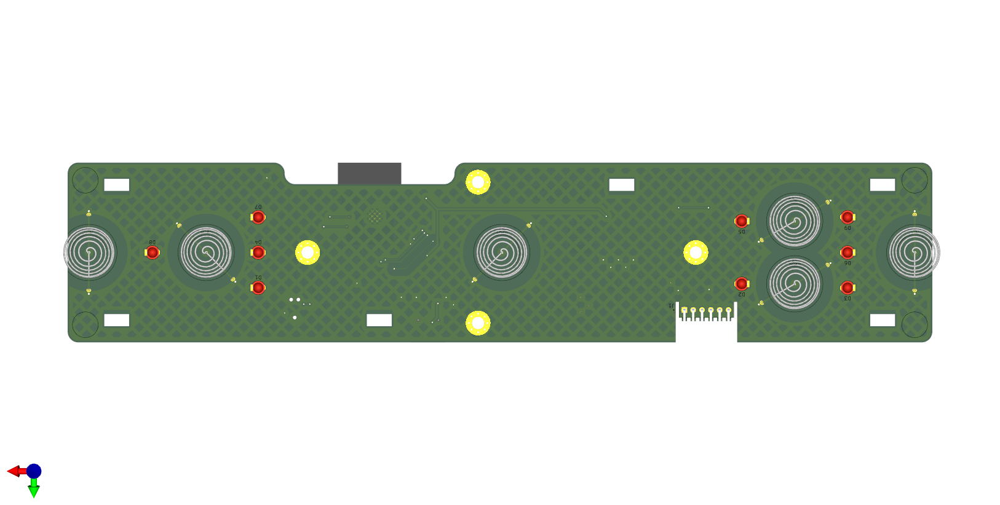
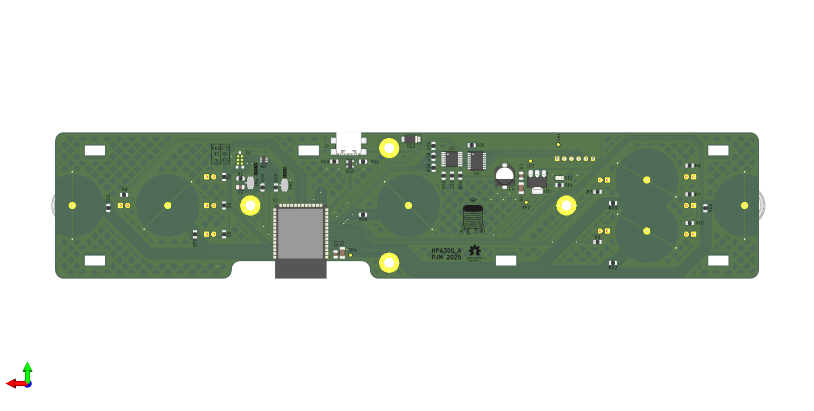

# HPA300 replacement controller hardware

An open-hardware, ESP32-S2 replacement control board for the Honeywell HPA300
air purifier. The board preserves the original front-panel layout while adding
USB-C, native USB programming, and a controller designed for the companion
[HPA300 firmware](https://github.com/patmont/HPA300-firmware).

<p align="center">
  
  
</p>

> [!IMPORTANT]
> This is an independent community project. It is not affiliated with,
> authorized by, or endorsed by Honeywell International Inc. Build and install
> it at your own risk.

## Downloads

| I want to... | Get this |
| --- | --- |
| Read the circuit | [Schematic PDF](HPA300.pdf) |
| Order the parts | [DigiKey shared list](https://www.digikey.com/en/mylists/list/1ANK154NOU) or [versioned BOM](manufacturing/Assembly/HPA300-bom.csv) |
| Order a bare PCB | Download the `HPA300-<version>-gerbers.zip` asset from the [latest release](https://github.com/patmont/HPA300-hardware/releases/latest) |
| Modify the design | Open [HPA300.kicad_pro](HPA300.kicad_pro) in KiCad 9 |
| Build or flash firmware | Visit [HPA300-firmware](https://github.com/patmont/HPA300-firmware) |

Release assets are the recommended manufacturing handoff because they are tied
to a tagged revision and include SHA-256 checksums. The files under
`manufacturing/` are reviewable snapshots; do not mix them with source files
from a different commit.

## Hardware overview

- ESP32-S2-SOLO-2 controller with native USB-C
- Six capacitive-touch keys matching the original control panel
- Nine front-panel indicators with PWM brightness control
- 74HC238 fan-speed selection with a hardware-disabled default state
- Boot, reset, Tag-Connect programming, and power test access
- Two-layer, 1.6 mm PCB designed in KiCad 9
- Approximately 245 mm × 51 mm overall outline, including the shaped edges

The current checked-in design is revision A and corresponds to the as-built
board. Before ordering, inspect the schematic, board outline, connector
orientation, and your purifier revision. This project has not been evaluated or
certified by a safety agency.

## Manufacturing

For a bare PCB, upload only the release's Gerber archive to the fabricator. It
contains copper, solder mask, paste, silkscreen, edge cuts, plated drills, and
non-plated drills. The archive is generated from the tracked files in
[`manufacturing/Fabrication`](manufacturing/Fabrication/).

The [DigiKey list](https://www.digikey.com/en/mylists/list/1ANK154NOU) is the
most convenient shopping list. The repository BOM is version controlled so a
release remains reproducible even if the shared list later changes. Check stock,
manufacturer part numbers, substitutions, and do-not-populate items before
ordering.

The current repository does **not** claim to be a turnkey PCBA package. An
assembly house will also need a placement/centroid file, confirmed rotations,
assembly drawings, and instructions for the through-hole and mechanical parts.
See [manufacturing/README.md](manufacturing/README.md) for the artifact manifest
and release procedure.

To build the same release assets locally from PowerShell:

```powershell
./scripts/package-release.ps1 -Version v1.0.0
```

The packages are written to `dist/`, which is intentionally ignored by Git.
Pushing a `v*` tag runs the same packager in GitHub Actions and creates a GitHub
release with the Gerber ZIP, schematic PDF, BOM, license notice, and checksum
manifest.

## Repository layout

```text
HPA300.kicad_pro         KiCad project entry point
HPA300.kicad_pcb         Editable PCB source
HPA300.kicad_sch         Root schematic and hierarchical sheets
*.kicad_sch
lib/                     Project-specific symbols, footprints, and 3D models
graphics/                Board renders, logo, and open-hardware mark
manufacturing/
  Fabrication/           Gerber and drill snapshot
  Assembly/              Version-controlled BOM
scripts/                 Reproducible release packaging
.github/workflows/       CI and tagged-release automation
```

KiCad backups, local preferences, caches, downloaded datasheets, and generated
release archives are excluded from version control. Custom symbols, footprints,
and 3D models required to open the project are kept in `lib/`.

## Contributing

Open an issue before making a change that affects the board outline, original
appliance interface, fan safety behavior, or manufacturing stack-up. For a
design change, update the editable KiCad source first, run KiCad's electrical
and design-rule checks, then regenerate the PDF, BOM, Gerbers, and drill files
together. Include the KiCad version and rule-check results in the pull request.

## License and attribution

The hardware design and associated source are licensed under the
[CERN Open Hardware Licence Version 2 – Weakly Reciprocal](LICENSE). You may
study, modify, make, and sell products based on the design, but the license
requires preservation of notices and corresponding-source obligations. See
[NOTICE.md](NOTICE.md) for the copyright, source-location, attribution, and
trademark notices that travel with the design.

Commercial use cannot be prohibited while also calling the project open-source
hardware. The reciprocal license and source-location notice are intended to
ensure that commercial derivatives remain attributable and that their design
changes are available to recipients.
